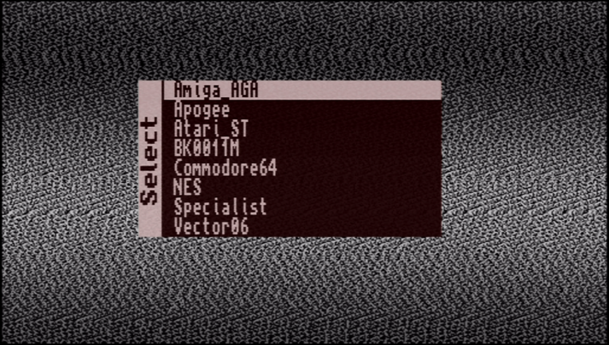

## It's a simple startup core to display menu in SiDi FPGA.

Unofficial port from Mist by DrWh0

Is required to update your SiDi firmware to version 240105

Put [this core](https://github.com/Dalekamistoso/drwh0-computer-sidi/releases/menu.rbf) to the root of SD card with name **core.rbf**. 
It will be loaded automatically upon MIST startup and menu will be displayed. 

### Background image

A BMP file with the dimensions of 512x312 and 32 bit color depth can be added as a background image. 
Just upload this BMP as MENU.ROM to the root of the SD Card.
